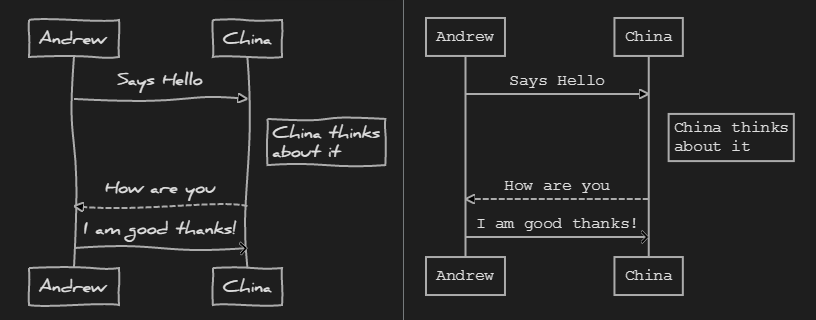
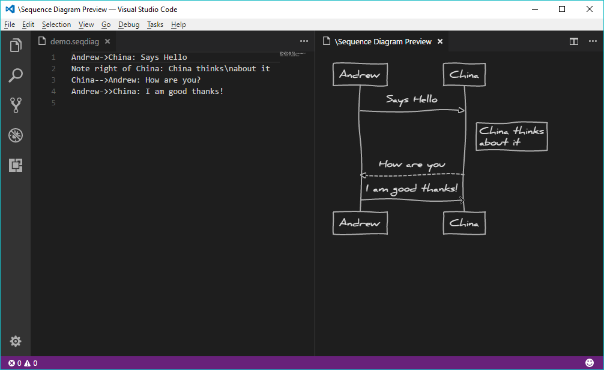

# Change Log

All notable changes to the "vscode-sequence-diagrams" extension will be documented in this file.

Check [Keep a Changelog](http://keepachangelog.com/) for recommendations on how to structure this file.

## [0.4.7] - 2021-04-12

- Updated npm packages for securty #30, #31

## [0.4.5] - 2021-04-12

- Fix assetPath function for production package (Community PR [#32](https://github.com/AleksandarDev/vscode-sequence-diagrams/pull/32) by [Joe Burns](https://github.com/JoeMcB))

## [0.4.4] - 2021-03-30

### Fixed

- Allow loading of resources from workspace root and extension's install directory (Community PR [#29](https://github.com/AleksandarDev/vscode-sequence-diagrams/pull/29) by [Chris Havekost](https://github.com/chrishavekost))

## [0.4.3] - 2021-01-23

### Fixed 

- Extension build errors (Community PR [#27](https://github.com/AleksandarDev/vscode-sequence-diagrams/pull/27) by [Joe Burns](https://github.com/JoeMcB))

## [0.4.1] - 2020-10-22

### Fixed 

- Sequence rendering (Community PR [#24](https://github.com/AleksandarDev/vscode-sequence-diagrams/pull/24)

## [0.4.0] - 2020-02-08

### Added

- Added UTF-8 support when exporting (Community PR [#17](https://github.com/AleksandarDev/vscode-sequence-diagrams/pull/17) 🚀)
- Preview can now be updated on file save or on every change

### Fixed

- Typo in settings description (Community PR [#15](https://github.com/AleksandarDev/vscode-sequence-diagrams/pull/15) 😎)

## [0.3.1] - 2018-09-16

### Fixed

- Fixed exporting diagram multiple times would fail

## [0.3.0] - 2018-09-15

### Added

- Added export to SVG
- Added export to PNG
- Added parsing error message is now showing in preview

## [0.2.1] - 2017-09-13

### Fixed

- Fixed diagram preview is blank on Unix systems

## [0.2.0] - 2017-09-07

### Added

- Added diagram style option to configuration

## [0.1.0] - 2017-09-06

### Added

- Added preview
- Added command "Show Sequence Diagram Preview"
- Added `.seqdiag` extensions support

