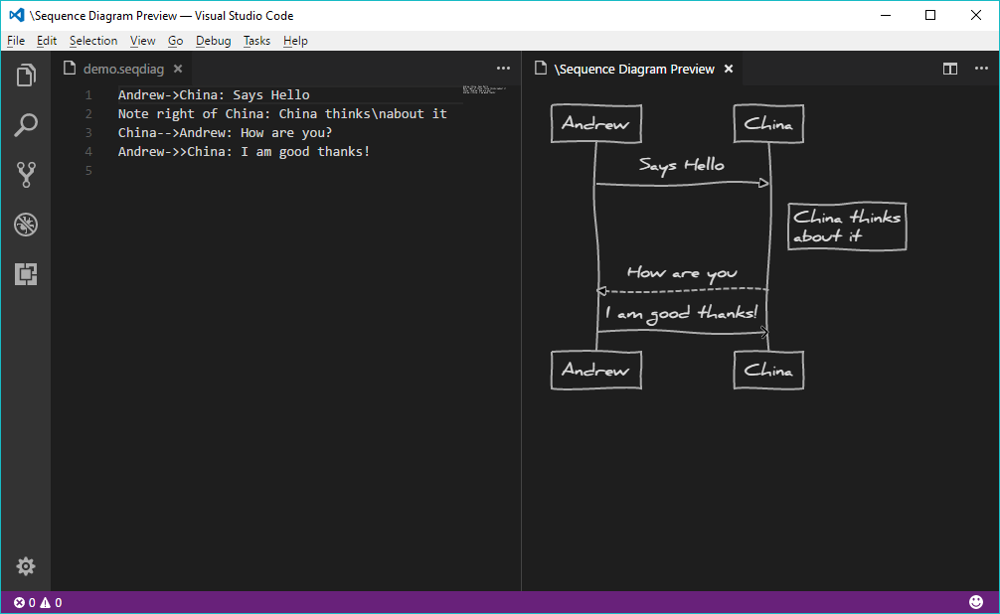

# VSCode Sequence Diagrams
_vscode-sequence-diagrams_

## How to

When you open `.seqdiag` file in Visual Studio Code, preview tab will open automatically. 

If you wish to reopen the preview tab, press `CTRL+SHIFT+P` to open Command Palette and execute `Show Sequence Diagram Preview` command.

See [js-sequence-diagrams](https://bramp.github.io/js-sequence-diagrams/) for syntax details.

## Configuration

| property                         | description                              |
|----------------------------------|------------------------------------------|
| `sequencediagrams.diagram.style` | The diagram style. Select between `hand` for hand drawn diagram or `simple` for diagram with simple straight lines. |

## Changelog

### v0.2.0 Preview (2017.09.07)
- New: Added diagram style option to configuration 

### v0.1.0 Preview (2017.09.06)
- New: Preview
- New: Command "Show Sequence Diagram Preview"
- New: `.seqdiag` extensions support

**Enjoy!**